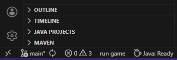

# Landscape Guesser

A New Zealand based geography game featuring 10 levels (more levels and locations will be added in the future), each with a unique location. The goal is to guess the correct location based on geographical hints. The closer your guess the higher your score!

**How to play the game:**

- Mouse: Use for panning and zooming on the map and panorama viewer.

- Keyboard - Press **q** to toggle the scoreboard (only available in levels and guessing stages).
  

**Scoring system**

Each level is score based on your distance from the marker, the further you are the less points you earn. The maximum score **per level** is **5,000**, and the maximum total score across **all levels** is **50,000**.

Graph representation of the scoring system:

# Requirements:

- Java installed
- 4GB ram 
- Stable internet connection for map rendering

# How to run the game

Unix/MacOsX:  
`./mvnw clean javafx:run`

Windows:  
`.\mvnw.cmd clean javafx:run`

OR

Click the 'run game' button at the bottom of your status bar

